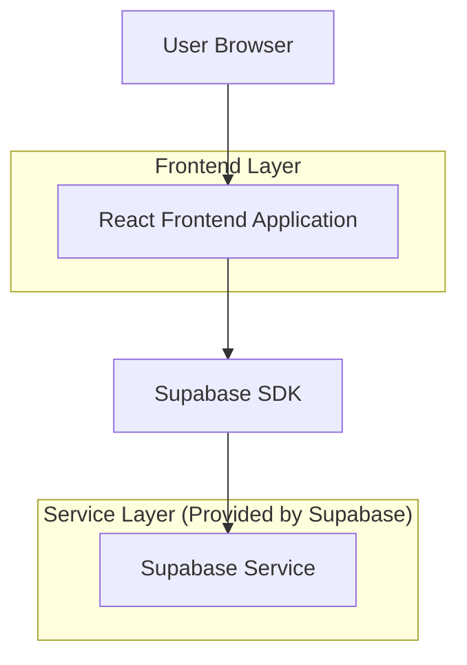
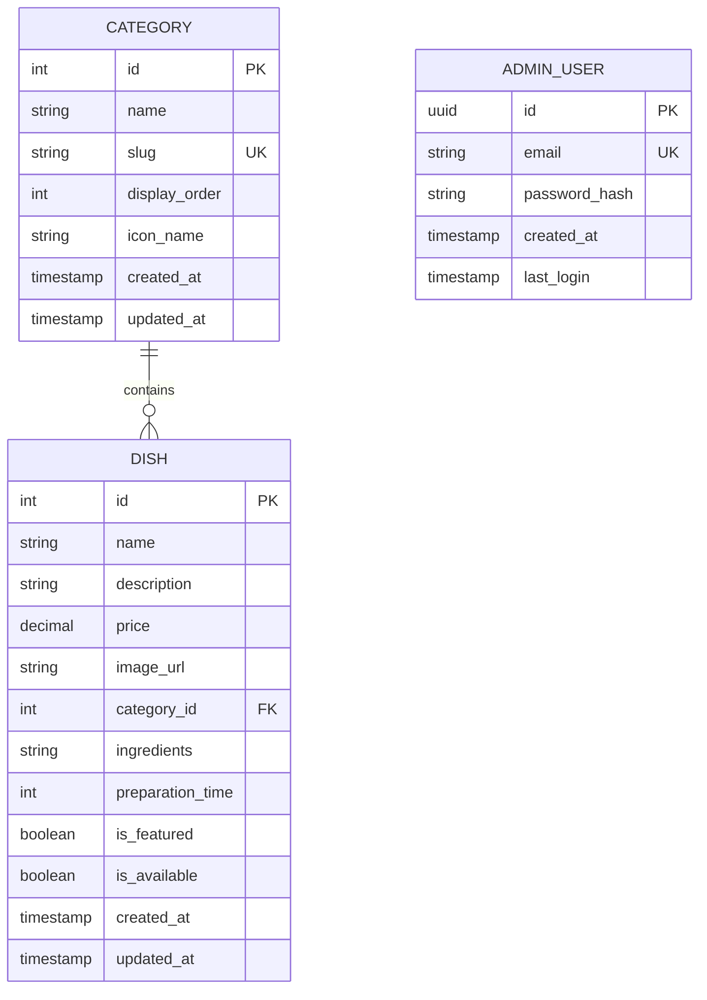

## 1. Architecture design



## 2. Technology Description
- Frontend: React@18 + tailwindcss@3 + vite
- Initialization Tool: vite-init
- Backend: Supabase (PostgreSQL)
- Additional Dependencies: @supabase/supabase-js@2, lucide-react (ícones)

## 3. Route definitions
| Route | Purpose |
|-------|---------|
| / | Página inicial com apresentação e navegação por categorias |
| /categoria/:slug | Lista de pratos filtrados por categoria |
| /prato/:id | Detalhes completos de um prato específico |
| /admin/login | Página de autenticação do administrador |
| /admin/dashboard | Dashboard administrativo protegido |
| /admin/categorias | Gerenciamento de categorias |
| /admin/categorias/nova | Formulário para criar nova categoria |
| /admin/categorias/editar/:id | Formulário para editar categoria existente |
| /admin/produtos | Gerenciamento de produtos |
| /admin/produtos/novo | Formulário para criar novo produto |
| /admin/produtos/editar/:id | Formulário para editar produto existente |

## 4. API definitions

### 4.1 Core API

Busca de categorias
```
GET /api/categories
```

Response:
| Param Name| Param Type  | Description |
|-----------|-------------|-------------|
| id | number | Identificador único da categoria |
| name | string | Nome da categoria (ex: "Entradas", "Pratos Principais") |
| slug | string | URL slug para navegação |
| order | number | Ordem de exibição |

Busca de pratos por categoria
```
GET /api/dishes?category=:slug
```

Response:
| Param Name| Param Type  | Description |
|-----------|-------------|-------------|
| id | number | Identificador único do prato |
| name | string | Nome do prato |
| description | string | Descrição detalhada |
| price | number | Preço em reais |
| image_url | string | URL da imagem do prato |
| category_id | number | ID da categoria |
| ingredients | string[] | Lista de ingredientes principais |
| preparation_time | number | Tempo de preparo em minutos |
| is_featured | boolean | Se é prato em destaque |

## 5. Server architecture diagram
Não aplicável - utilizamos Supabase como backend-as-a-service sem servidor próprio.

## 6. Data model

### 6.1 Data model definition


### 6.2 Data Definition Language

Tabela de Categorias (categories)
```sql
-- create table
CREATE TABLE categories (
    id SERIAL PRIMARY KEY,
    name VARCHAR(100) NOT NULL,
    slug VARCHAR(100) UNIQUE NOT NULL,
    display_order INTEGER DEFAULT 0,
    icon_name VARCHAR(50),
    created_at TIMESTAMP WITH TIME ZONE DEFAULT NOW()
);

-- create index
CREATE INDEX idx_categories_slug ON categories(slug);
CREATE INDEX idx_categories_order ON categories(display_order);

-- init data
INSERT INTO categories (name, slug, display_order, icon_name) VALUES
('Entradas', 'entradas', 1, 'salad'),
('Pratos Principais', 'pratos-principais', 2, 'utensils'),
('Sobremesas', 'sobremesas', 3, 'ice-cream'),
('Bebidas', 'bebidas', 4, 'wine');
```

Tabela de Pratos (dishes)
```sql
-- create table
CREATE TABLE dishes (
    id SERIAL PRIMARY KEY,
    name VARCHAR(200) NOT NULL,
    description TEXT NOT NULL,
    price DECIMAL(10,2) NOT NULL,
    image_url TEXT,
    category_id INTEGER REFERENCES categories(id),
    ingredients TEXT,
    preparation_time INTEGER,
    is_featured BOOLEAN DEFAULT false,
    is_available BOOLEAN DEFAULT true,
    created_at TIMESTAMP WITH TIME ZONE DEFAULT NOW(),
    updated_at TIMESTAMP WITH TIME ZONE DEFAULT NOW()
);

-- create index
CREATE INDEX idx_dishes_category ON dishes(category_id);
CREATE INDEX idx_dishes_featured ON dishes(is_featured);
CREATE INDEX idx_dishes_available ON dishes(is_available);

-- init data example
INSERT INTO dishes (name, description, price, image_url, category_id, ingredients, preparation_time, is_featured) VALUES
('Bruschetta Tradizionale', 'Pão italiano grelhado com tomates frescos, manjericão e azeite extra virgem', 28.90, '/images/bruschetta.jpg', 1, 'Pão italiano, tomates cereja, manjericão, azeite', 15, true),
('Linguine alle Vongole', 'Massa linguine com molho de marisco e lascas de parmesão', 89.90, '/images/linguine-vongole.jpg', 2, 'Linguine, vongole, alho, vinho branco, parmesão', 25, true);

-- Supabase Row Level Security (RLS) policies
ALTER TABLE categories ENABLE ROW LEVEL SECURITY;
ALTER TABLE dishes ENABLE ROW LEVEL SECURITY;

-- Grant access
GRANT SELECT ON categories TO anon;
GRANT SELECT ON dishes TO anon;
GRANT ALL ON categories TO authenticated;
GRANT ALL ON dishes TO authenticated;

-- RLS Policies
CREATE POLICY "Anyone can view categories" ON categories FOR SELECT USING (true);
CREATE POLICY "Anyone can view available dishes" ON dishes FOR SELECT USING (is_available = true);
CREATE POLICY "Authenticated users can manage categories" ON categories FOR ALL TO authenticated USING (true) WITH CHECK (true);
CREATE POLICY "Authenticated users can manage dishes" ON dishes FOR ALL TO authenticated USING (true) WITH CHECK (true);
```
