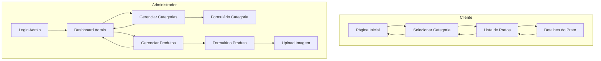

## 1. Product Overview
Cardápio digital para o Restaurante Romã, permitindo aos clientes visualizar os pratos, preços e descrições de forma interativa e responsiva. O sistema visa modernizar a experiência de pedido, eliminando cardápios físicos e proporcionando uma interface intuitiva e atraente.

O produto atende restaurantes que buscam digitalizar seu atendimento, oferecendo uma solução profissional e fácil de usar para os clientes.

## 2. Core Features

### 2.1 User Roles
| Role | Registration Method | Core Permissions |
|------|---------------------|------------------|
| Customer | Não requer cadastro | Visualizar cardápio, navegar por categorias, ver detalhes dos pratos |
| Admin | Supabase Auth (email/senha) | Gerenciar categorias (CRUD), gerenciar produtos (CRUD), fazer upload de imagens |

### 2.2 Feature Module
O cardápio digital consiste nas seguintes páginas principais:
1. **Página Inicial**: apresentação do restaurante com logo, navegação por categorias e destaques.
2. **Cardápio por Categoria**: listagem de pratos organizados por tipo (entrada, prato principal, sobremesa, bebidas).
3. **Detalhes do Prato**: visualização ampliada com foto, descrição completa, preço e ingredientes.
4. **Login Administrativo**: página de autenticação para acesso ao painel administrativo.
5. **Painel Administrativo**: dashboard com gestão de categorias e produtos.
6. **Gerenciamento de Categorias**: formulário para criar/editar categorias.
7. **Gerenciamento de Produtos**: formulário para criar/editar produtos com upload de imagens.

### 2.3 Page Details
| Page Name | Module Name | Feature description |
|-----------|-------------|---------------------|
| Página Inicial | Header com Logo | Exibir o logo do Restaurante Romã fornecido, com design elegante e profissional |
| Página Inicial | Seção de Boas-vindas | Apresentar mensagem de boas-vindas e breve descrição do restaurante |
| Página Inicial | Navegação por Categorias | Permitir navegação rápida entre as categorias do cardápio |
| Página Inicial | Pratos em Destaque | Mostrar pratos especiais ou mais populados em destaque na página inicial |
| Cardápio por Categoria | Lista de Pratos | Exibir todos os pratos da categoria selecionada com foto miniatura, nome e preço |
| Cardápio por Categoria | Filtro de Preço | Permitir ordenação por preço (menor para maior) |
| Detalhes do Prato | Imagem Ampliada | Mostrar foto grande e apetitosa do prato |
| Detalhes do Prato | Descrição Completa | Exibir descrição detalhada, ingredientes principais e tempo de preparo |
| Detalhes do Prato | Preço Prominente | Destacar o preço do prato de forma clara |
| Detalhes do Prato | Botão Voltar | Permitir retorno fácil à lista de pratos |
| Login Administrativo | Formulário de Login | Campos para email e senha, validação via Supabase Auth |
| Painel Administrativo | Dashboard Overview | Exibir estatísticas rápidas, acesso rápido a categorias e produtos |
| Painel Administrativo | Lista de Categorias | Exibir categorias cadastradas com opções de editar/excluir |
| Painel Administrativo | Lista de Produtos | Exibir produtos cadastrados com foto miniatura, preço e status |
| Gerenciamento de Categorias | Formulário Categoria | Campos para nome e ordem de exibição, validação de campos |
| Gerenciamento de Produtos | Formulário Produto | Campos para nome, descrição, preço, categoria, upload de imagem e disponibilidade |
| Gerenciamento de Produtos | Upload de Imagem | Seletor de arquivo com preview, upload automático para Supabase Storage |

## 3. Core Process
**Fluxo do Cliente**: O cliente inicia na página inicial onde vê o logo do Restaurante Romã e pode navegar pelas categorias do cardápio. Ao selecionar uma categoria, visualiza todos os pratos disponíveis com fotos e preços. Clicando em um prato específico, acessa os detalhes completos com descrição, ingredientes e foto ampliada. Pode voltar à lista de pratos ou escolher outra categoria a qualquer momento.

**Fluxo do Administrador**: O administrador acessa a página de login através de URL protegida. Após autenticação via Supabase, é redirecionado para o dashboard administrativo. No painel, pode gerenciar categorias (criar, editar, excluir) e produtos (criar, editar, excluir). Ao criar/editar produtos, pode fazer upload de imagens que são armazenadas no Supabase Storage. Todas as alterações refletem imediatamente no cardápio público.

## 4. User Interface Design

### 4.1 Design Style
- **Cores Primárias**: Tons de vermelho vinho e dourado, remetendo à identidade italiana e sofisticação
- **Cores Secundárias**: Branco e cinza claro para contraste e legibilidade
- **Estilo de Botões**: Arredondados com sombra sutil, efeito hover suave
- **Fontes**: Serif para títulos (ex: Playfair Display), Sans-serif para conteúdo (ex: Open Sans)
- **Tamanhos de Fonte**: Títulos 24-32px, Descrições 16px, Preços 20px em negrito
- **Layout**: Baseado em cards com imagens atrativas, navegação superior fixa
- **Ícones**: Estilo outline minimalista, preferencialmente em tons de dourado

### 4.2 Page Design Overview
| Page Name | Module Name | UI Elements |
|-----------|-------------|-------------|
| Página Inicial | Header com Logo | Logo centralizado, background em gradiente vinho-dourado, altura 200px |
| Página Inicial | Navegação Categorias | Cards horizontais com ícones e nomes das categorias, scroll horizontal em mobile |
| Página Inicial | Pratos Destaque | Grid responsivo 2x2 em desktop, 1 coluna em mobile, cards com borda dourada |
| Cardápio por Categoria | Lista de Pratos | Cards verticais com imagem 16:9, nome em fonte serif 18px, preço em dourado 20px |
| Detalhes do Prato | Imagem Principal | Imagem full-width, altura 300px, overlay com nome do prato |
| Detalhes do Prato | Informações | Background branco com padding 20px, descrição em cinza escuro, preço destacado em vinho |

### 4.3 Responsiveness
O design é mobile-first, otimizado principalmente para smartphones utilizados pelos clientes nas mesas. A interface se adapta perfeitamente a tablets e desktops, mas prioriza a experiência mobile com touch otimizado, cards grandes para fácil seleção e navegação por gestos. Imagens são otimizadas para carregamento rápido em conexões 3G/4G.

### 4.4 3D Scene Guidance
Não aplicável - este projeto não envolve conteúdo 3D.
